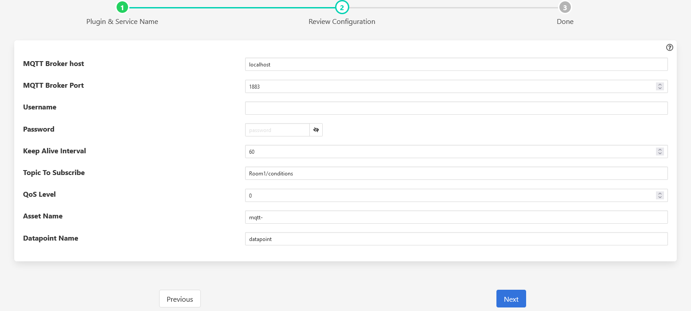

.. Images

South MQTT
==========

The *fledge-south-mqtt* plugin allows to create an MQTT subscriber service. MQTT Subscriber reads messages from topics on the MQTT broker.

To create a south service you, as with any other south plugin

  - Select *South* from the left hand menu bar.

  - Click on the + icon in the top left

  - Choose mqtt from the plugin selection list

  - Name your service

  - Click on *Next*

  - Configure the plugin

    +------------+
    | |mqtt-sub| |
    +------------+

    - **MQTT Broker host**: Hostname or IP address of the broker to connect to.

    - **MQTT Broker Port**: The network port of the broker.

    - **Keep Alive Interval**: Maximum period in seconds allowed between communications with the broker. If no other messages are being exchanged, this controls the rate at which the client will send ping messages to the broker.

    - **Topic To Subscribe**: The subscription topic to subscribe to receive messages.

    - **QoS Level**: The desired quality of service level for the subscription.

    - **Asset Name**: Name of Asset.

  - Click *Next*

  - Enable your service and click *Done*

JSON Payload
------------

The content of the *readings* object is a set of JSON properties. The payload (byte-array) of published messages should be a JSON object. 

+-----------+----------------------------------------------------------------+
| Name      | Description                                                    |
+===========+================================================================+
| timestamp | The timestamp will be generated locally by the plugin.         |
+-----------+----------------------------------------------------------------+
| asset     | The name of the asset configured.                              |
+-----------+----------------------------------------------------------------+
| readings  | A JSON object parsed from received message payload.            |
+-----------+----------------------------------------------------------------+

Example of Published Message Payload
------------------------------------

.. code-block:: console

    $ mosquitto_pub -h localhost -t "Room1/conditions" -m '{"humidity": 93.29, "temp": 16.82}'
